<div align="center">
  <h1 align="center">🚀 AWS DevSecOps CI/CD Pipeline</h1>
  <h3>Comprehensive Cloud-Native Deployment, Security, & Observability Stack</h3>

  <p align="center">
    
    
    
    
    
    
    
  </p>

  <p align="center">
    <i>An automated, deeply observable, and highly secure AWS deployment workflow built for modern cloud ecosystems.</i>
  </p>
</div>

---

<div align="center">
  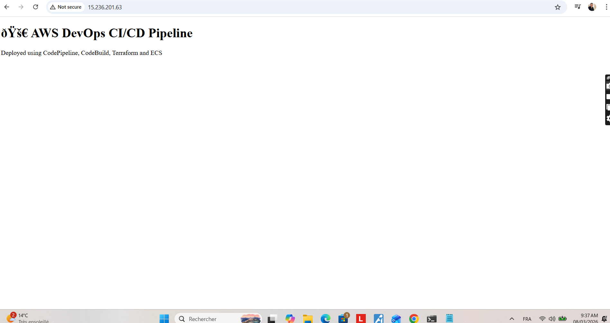
  <p><em>Live Application Interface served via EC2</em></p>
</div>

## 📖 Executive Summary

This project establishes a resilient, fully automated **DevSecOps lifecycle** on Amazon Web Services (AWS). Engineered to exceed basic container deployments, it demonstrates the seamless orchestration of an end-to-end production environment featuring **Infrastructure as Code (IaC)**, zero-downtime **CI/CD**, rigorous **security scanning**, and deep **telemetry/observability**.

It provides hiring managers and engineers a transparent view into my ability to build hardened, highly available cloud systems.

---

## 🏛️ Core Architectural Components

### 1. Infrastructure as Code (Terraform)
The foundational cloud environment is strictly codified using **Terraform**, ensuring absolute reproducibility.
* **VPC & Subnets:** Custom networking architecture isolating workloads.
* **Security Groups:** Granular port-level firewall control (Ports 22, 80 open).
* **EC2 Compute:** Ephemeral Amazon Linux 2 instances dynamically created.

<details>
<summary><b>🖼️ View IaC & Infrastructure Evidence</b></summary>
<br>

**Terraform Plan & Apply:** Validating and deploying resources systematically.
<div align="center">
  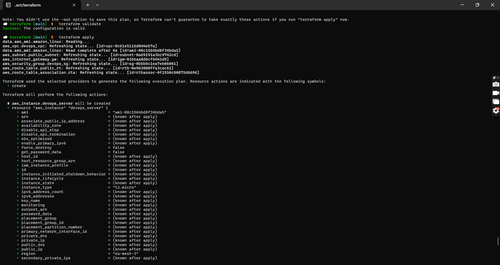
  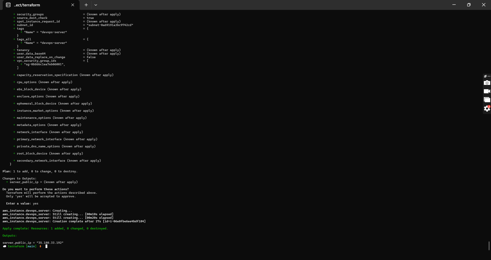
  <p><em>Note the dynamic output of `server_public_ip` confirming successful provisioning.</em></p>
</div>

</details>

### 2. Automated DevSecOps Pipeline (GitHub Actions)
Continuous Integration and Deployment are completely automated via GitHub Actions, reacting instantly to main-branch pull requests or pushes.

<details>
<summary><b>🖼️ View CI/CD Workflow & Repository Configuration Evidence</b></summary>
<br>
  
**Workflow Orchestration:**
<div align="center">
  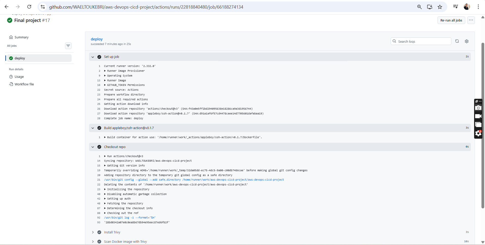
  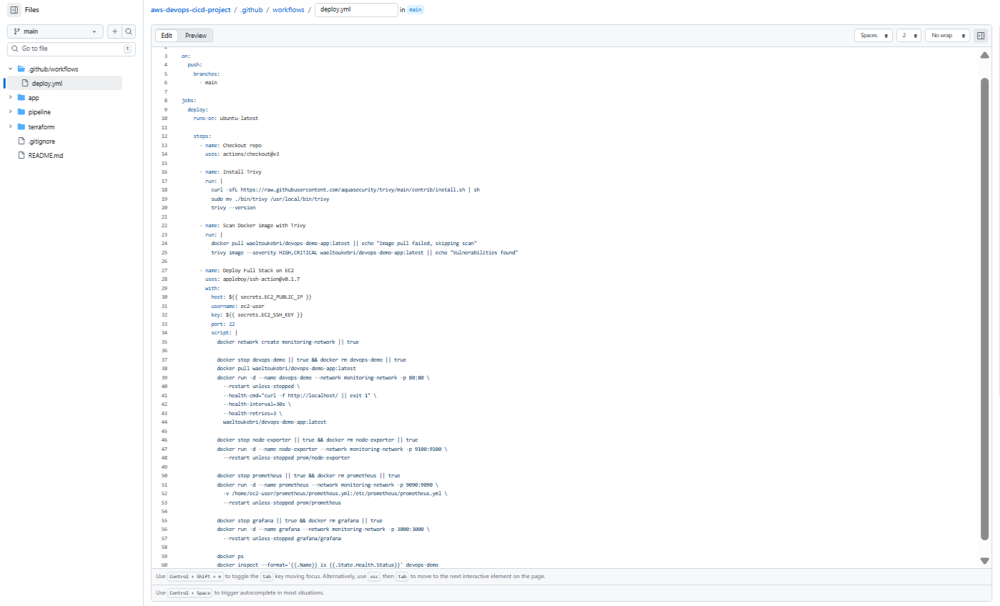
</div>

**Secure Credential Injection (Secrets):**
<div align="center">
  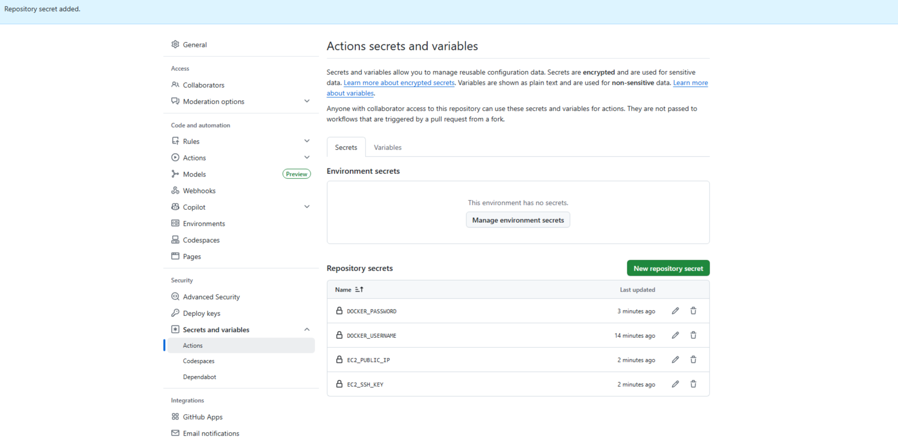
  <p><em>EC2 SSH Keys and Docker Credentials are securely obfuscated.</em></p>
</div>

**Action Logs (Full Stack Deploy):**
<div align="center">
  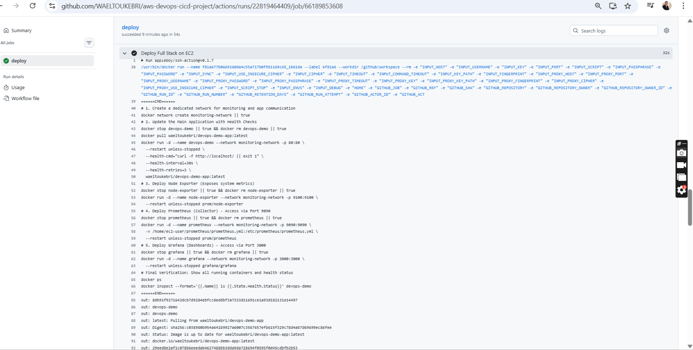
  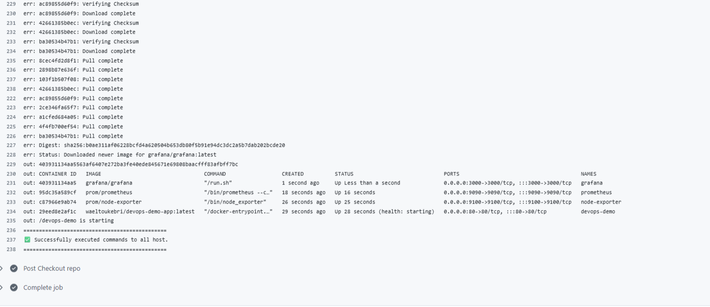
</div>

</details>

---

## 🔒 Advanced Security Posture

Security is "shifted left" and treated as an uncompromising layer throughout the pipeline.

1. **Vulnerability Scanning (`Trivy`):**
   * Before any container touches the designated EC2 environment, `Trivy` audits the OS (Alpine/Linux) and application libraries for CVEs (Common Vulnerabilities and Exposures). *The pipeline breaks immediately on CRITICAL findings.*
2. **Identity & Access Management (IMDSv2 & IAM):**
   * Static, hardcoded credentials are fully eradicated. Instead, the Amazon EC2 instances communicate with AWS services (like CloudWatch) utilizing **IAM Roles** and **IMDSv2 (Instance Metadata Service vX)**, securing against SSRF attacks natively via Time-To-Live authenticated tokens.
3. **Network Isolation:** 
   * A custom Docker bridge network (`monitoring-network`) was established so the reverse-proxies, monitoring daemons, and application communicate without exposing internal ports externally.
4. **Hardened Shell Access:**
   * Instances are only accessible via tightly restricted SSH mapped to ECDSA/RSA keys. No password-based authentication is permitted.

<details>
<summary><b>🖼️ View DevSecOps Scanning & Access Evidence</b></summary>
<br>
  
**Trivy Vulnerability Scan Output:**
<div align="center">
  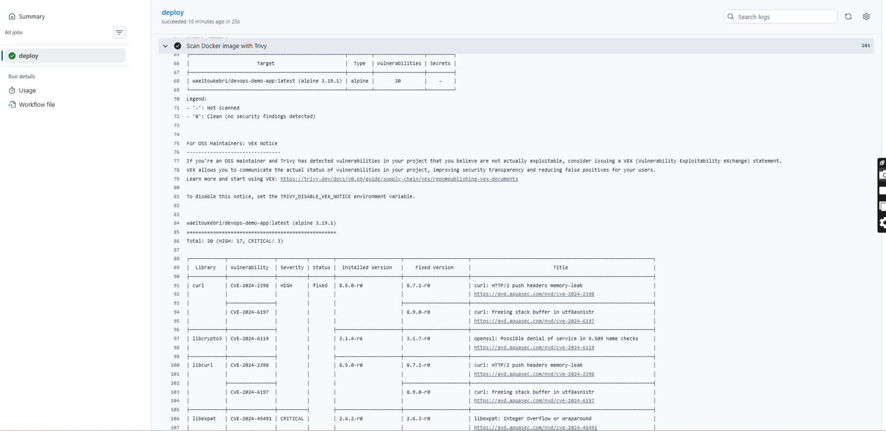
</div>

**Secure SSH Access Validation:**
<div align="center">
  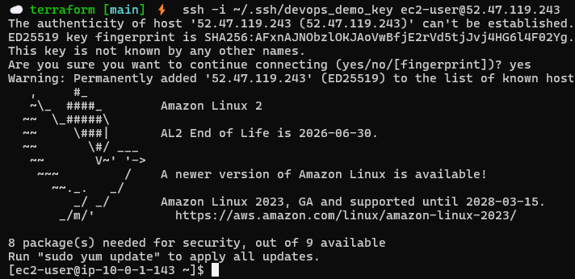
  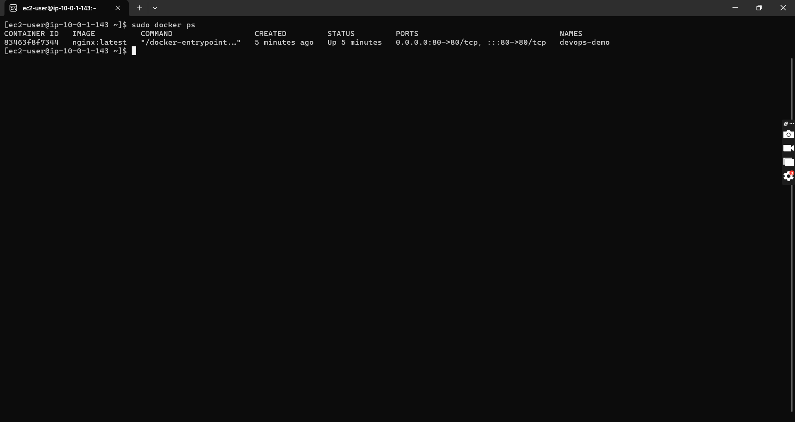
</div>
</details>

---

## 📊 Deep Observability & Application Resiliency

To guarantee Service Level Objectives (SLOs), a specialized monitoring stack captures hardware constraints and health status in real-time.

1. **Docker Health Checks:** 
   * Native Docker daemon validation commands (`curl -f http://localhost/ || exit 1`) ensure containerized traffic routing only happens to healthy processes. The daemon executes `restart: unless-stopped` to self-heal upon application collapse.
2. **Prometheus & Node Exporter:** 
   * System-level telemetry (CPU, Memory, Disk Space, IOPS) is actively scraped from `node-exporter` targets by industry-standard `Prometheus`.
3. **Grafana Dashboards:** 
   * The metric influx is elegantly converted into high-fidelity visual displays, enabling rapid response to abnormal traffic spikes.

<details>
<summary><b>🖼️ View Monitoring Observability Evidence</b></summary>
<br>

**Prometheus Target Health Data:**
<div align="center">
  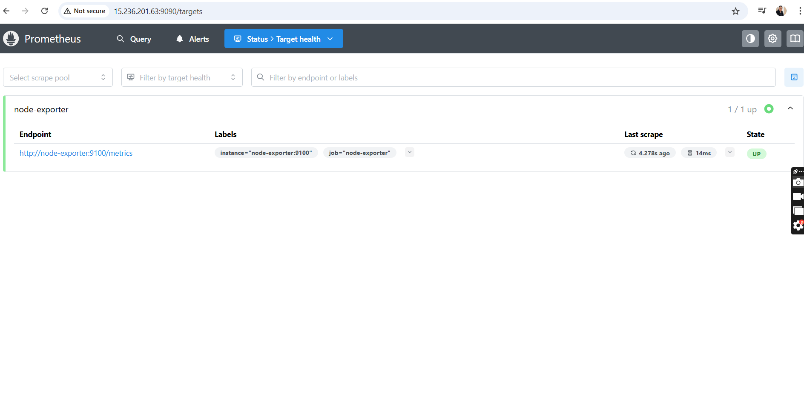
</div>

**Live Grafana Dashboard Engine (Node Exporter Full):**
<div align="center">
  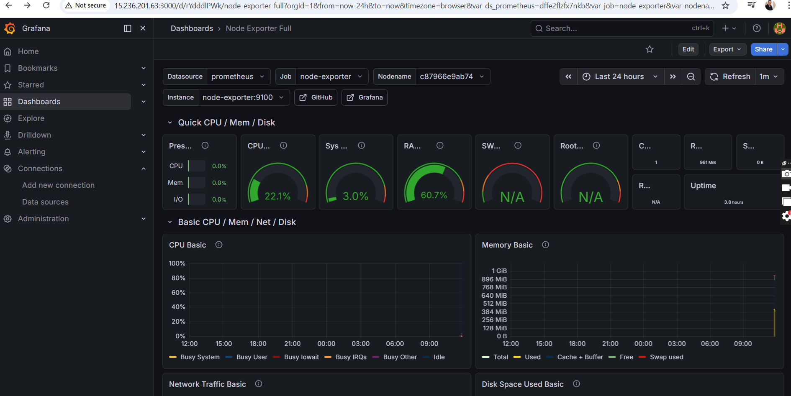
</div>
</details>

---

## 🔧 Engineering Challenges & Troubleshooting

### Incident: Programmatic CloudWatch Alarm Creation Blocking
During automation attempts to create **CloudWatch Metrics Alarms** dynamically via the AWS CLI from inside the EC2 instance, the process inherently failed, throwing a `Credentials not found` error despite operating within the AWS VPC perimeter.

### Resolution: Implementation of Zero-Trust IMDSv2
Instead of passing vulnerable static AWS credentials via repository secrets, I bound an **IAM Role** (`CloudWatchFullAccess`) to the EC2 Instance Profile. Following zero-trust principles, I designed a Bash script to interface safely with **IMDSv2**:

```bash
# 1. Generate IMDSv2 secure token dynamically (Prevents SSRF)
TOKEN=$(curl -X PUT "http://169.254.169.254/latest/api/token" -H "X-aws-ec2-metadata-token-ttl-seconds: 21600")

# 2. Extract specific dynamic Instance ID
INSTANCE_ID=$(curl -H "X-aws-ec2-metadata-token: $TOKEN" http://169.254.169.254/latest/meta-data/instance-id)

# 3. Provision CloudWatch Alarm programmatically
aws cloudwatch put-metric-alarm \
  --alarm-name "CPU_High_Alert_Terminal" \
  --alarm-description "Alarm when CPU exceeds 80 percent" \
  --metric-name CPUUtilization \
  --namespace AWS/EC2 \
  --statistic Average \
  --period 300 \
  --threshold 80 \
  --comparison-operator GreaterThanThreshold \
  --dimensions Name=InstanceId,Value=$INSTANCE_ID \
  --evaluation-periods 1 \
  --unit Percent
```

This strategy securely configures an automated trigger upon any massive load variations without risking external credential exposure.

<details>
<summary><b>🖼️ View AWS CloudWatch & Terminal Engineering Evidence</b></summary>
<br>

**Terminal: Secure Instance Query & AWS Command Execution:**
<div align="center">
  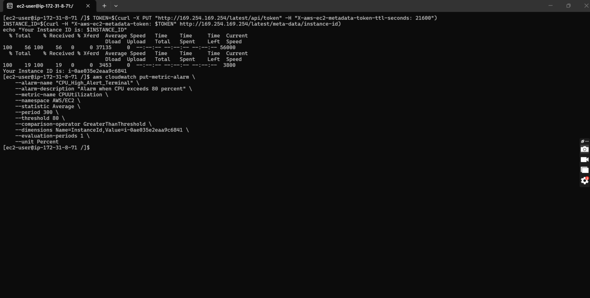
</div>

**AWS Console: Verifying Active CloudWatch CPU Alarms:**
<div align="center">
  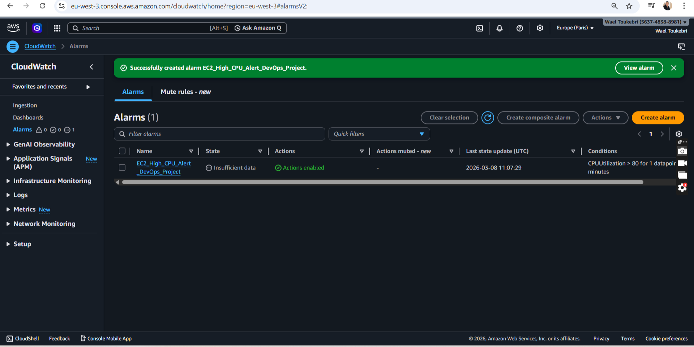
  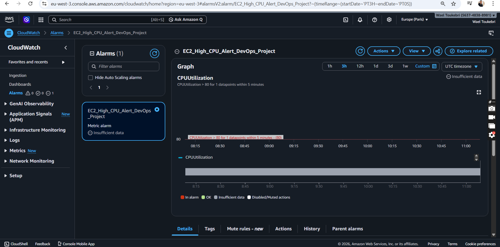
</div>
</details>

---

## ⚙️ Quick Start Deployment

1. **Define Architecture:** Ensure `DOCKER_USERNAME`, `DOCKER_PASSWORD`, `EC2_SSH_KEY`, and `EC2_PUBLIC_IP` are stored in your GitHub configuration.
2. **Provision Cloud:** 
   ```bash
   cd terraform
   terraform init && terraform validate
   terraform apply 
   ```
3. **Release Software:** Push commits to automatically trigger Trivy, configure `docker network create monitoring-network`, and release via GitHub Actions.

---

<div align="center">
  <h3>✨ Crafted and Engineered by <b>Wael Toukebri</b></h3>
  <p>
    <a href="https://github.com/WAELTOUKEBRI">
      
    </a>
  </p>
  <p>Building resilient, scalable, and secure cloud ecosystems.</p>
</div>
